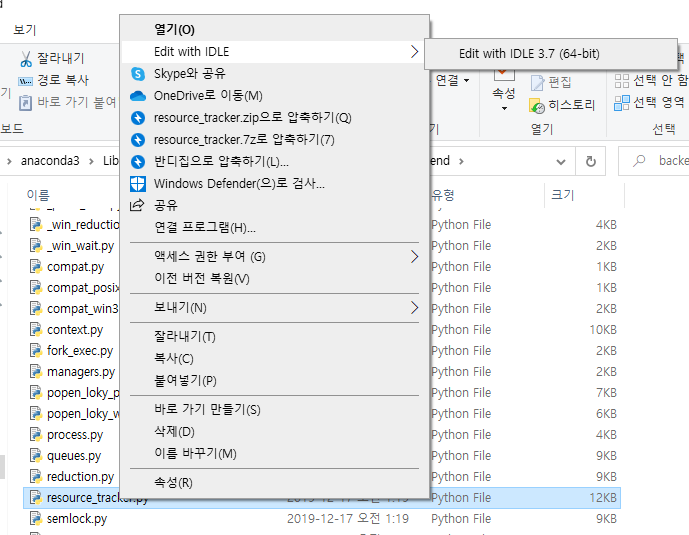
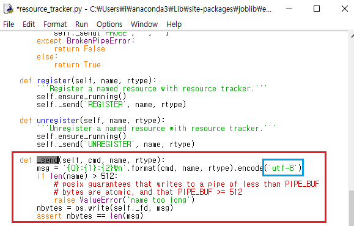

###  :pencil2: n_jobs

sklearn 패키지를 활용하여 머신러닝 모델링을 하다보면 학습을 진행시키는 fit 함수 옵션에서 n_jobs 파라미터를 자주 볼 수 있다.


이 파라미터는 학습 진행에 있어 하드웨어상 CPU의 코어를 하나 이상 사용하여 병렬 계산을 가능하게 하는 옵션인데 `n_jobs = -1`  로 설정하면 컴퓨터의 모든 코어를 사용하게 된다.


__내가 마주친 문제점__ 은 다음과 같다.

- 별도로 n_jobs 옵션을 설정하지 않아도 학습을 시도하였을때 다음과 같은 에러 메세지가 출력

```python
UnicodeEncodeError                        Traceback (most recent call last)
<ipython-input-13-93a1aa3c1ec2> in <module>
.
.
.
C:\Anaconda3\lib\site-packages\joblib\_parallel_backends.py in configure(self, n_jobs, parallel, prefer, require, idle_worker_timeout, **memmappingexecutor_args)
.
.

C:\Anaconda3\lib\site-packages\joblib\executor.py in get_memmapping_executor(n_jobs, **kwargs)
.
.
.
.
.
.
.

C:\Anaconda3\lib\site-packages\joblib\externals\loky\backend\resource_tracker.py in _send(self, cmd, name, rtype)
    202 
    203     def _send(self, cmd, name, rtype):
--> 204         msg = '{0}:{1}:{2}\n'.format(cmd, name, rtype).encode('ascii')
    205         if len(name) > 512:
    206             # posix guarantees that writes to a pipe of less than PIPE_BUF

UnicodeEncodeError: 'ascii' codec can't encode characters in position 18-23: ordinal not in range(128)
```

 

> 아니 학습을 돌리는데 shape -mismatch , contains NA , 이런 문제들도 아니고 디코딩 에러라니 이 무슨...??


Traceback 내용을 살펴보니 별도로 설정하지 않아도 디폴트로 인해 n_jobs=1 옵션이 적용됨에 따라서 학습 환경을 구성할때 문제가 있는것으로 보였다. 


joblib 패키지의 _parallel_backends.py 파일 실행에 의해 병렬처리 여부 백엔드 설정을 진행하는듯한데 이 과정에서 무엇인가 인코딩 문제가 발생한것을 확인하고 구글에 미친듯이 검색했다.


절망적이게도 비슷한 문제를 올리는 질문자들은 있으나 세부적으로는 다른 파일에서 문제가 있던 질문이거나 해결 답변이 달려있지 않은 질문들 뿐이었다.


그때 Stack Overflow 에서 이런 답변이 달려있는 것을 보았다.

```
Why don't you send your config msg with encode('utf-8') ?
```


> 아니 내가 별도로 무슨 전달 메세지 작성한것도 아니고 저건 내부적으로 파일을 실행하면서 환경 초기화 하는거일텐데 직접 utf-8 로 인코딩 하라는게 무슨 소리지..?


근데 혹시나 싶어서 내가 직접  __resource_tracker.py__ 파일에 있는  _send 메소드를 수정해 보았다.


  


 


수정한 뒤 돌려보니..


언제 그랬냐는듯이 너무도 잘 돌아갔다..


해결이 된건 기쁘지만 검색에 쏟은 4시간이 너무 허무했던 해결 방법이었다.