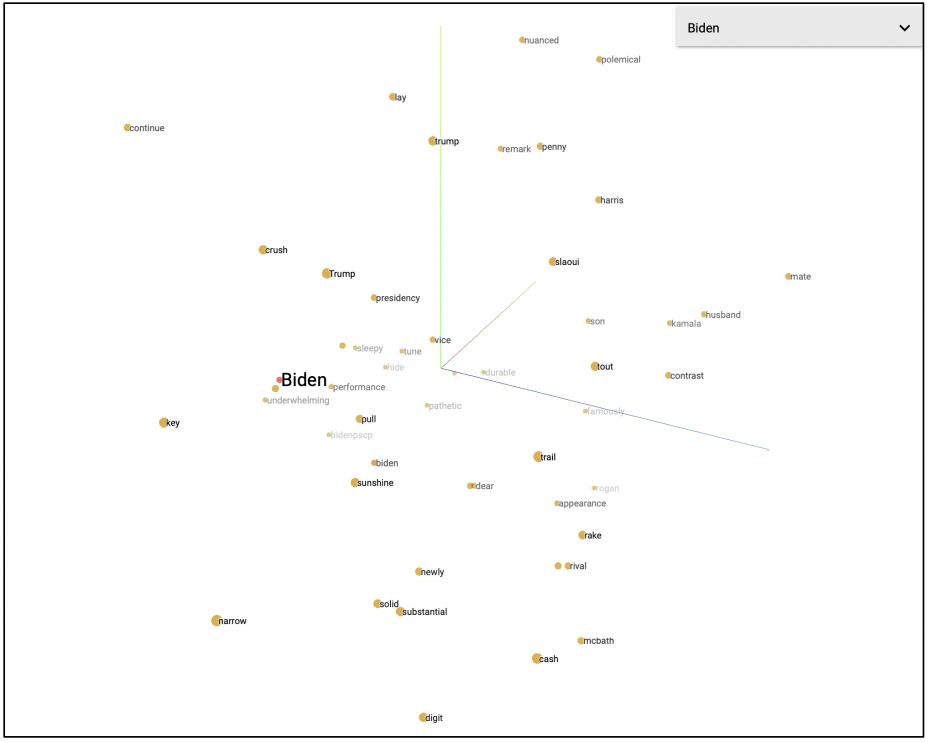
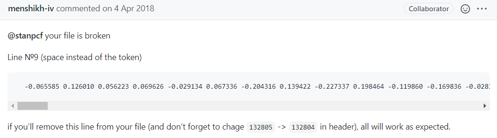
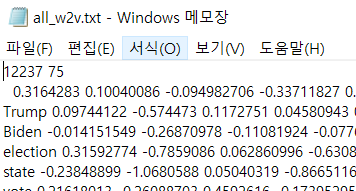
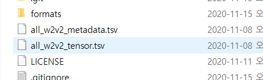

# Embedding Projector? 

​	

[뉴스 & 트위터 & 토론 텍스트 마이닝을 통한 2020 대선 예측](https://github.com/ineed-coffee/text_mining_for_US_election) 프로젝트를 진행하며 Word2Vec 알고리즘에 대해 학습하며 이 알고리즘이 원핫 인코딩의 한계점을 어떻게 극복하며 , 유사한 단어가 어떻게 벡터 공간에서 더 가까운 거리에 맵핑되는지 학습할 수 있었다. 

​	

이런 Word2Vec 맵핑을 결과를 시각화할 수 있는 여러 방법 중 구글에서 지원하는 __임베딩 프로젝터__ 툴을 활용해보기로 했다.

​	

임베딩 프로젝터를 활용하면 각 단어의 임베딩 결과 데이터 파일 (tsv 형식) 을 로드해주면 웹에서 시각화 결과를 3차원으로 확인할 수 있으며 차원 축소를 위한 PCA , t-SNE 와 같은 작업 및 키워드 입력으로 most_similar 추출도 가능하다. 

​	

아래와 같은 화면이 임베딩 프로젝터를 통한 시각화 결과 화면이다.

 


---

​	

# Problem

​	

gensim 패키지의 Word2Vec 모듈을 활용한 임베딩 작업을 진행하였을때를 기준으로, 위에서 언급한 tsv 파일을 생성하기 위해서는 다음과 같은 두 과정을 실행하면 된다.

​	

`1. 임베딩 결과를 텍스트 형태로 file save` 

```python
model.wv.save_word2vec_format('경로 포함 파일명') 
```

​	

`2. step1 에서 저장한 파일로부터 tensor.tsv 파일과 metadata.tsv 파일 생성` 

```python
!python -m gensim.scripts.word2vec2tensor --input 경로 포함 파일명 --output 경로 포함 파일명
```

※ '경로 포함 파일명' 부분에는 step1 에서 생성한 파일의 경로 포함 파일명을 넣어주어야한다.

***

​	

> 위 과정대로 따라해보기로 했다.

```python
model.wv.save_word2vec_format('all_w2v')
```

- 임베딩 작업을 진행한 모델 객체에서 임베딩 결과를 텍스트 형태로 저장하였다.

  

> __그런데 1번 과정은 잘 수행되나 2번 과정에서 문제가 발생하였다.__   

```python
Traceback (most recent call last):
		.
		.
		.
  File "D:\Anaconda3\lib\site-packages\gensim\models\keyedvectors.py", line 1498, in load_word2vec_format
    limit=limit, datatype=datatype)
  File "D:\Anaconda3\lib\site-packages\gensim\models\utils_any2vec.py", line 394, in _load_word2vec_format
    raise ValueError("invalid vector on line %s (is this really the text format?)" % line_no)
ValueError: invalid vector on line 165 (is this really the text format?)
```

​	

> 165번 줄의 형식이 이상한듯한데 텍스트 형식이 맞나요? 라는 오류라는데... 그럼 1번 과정에서 .txt 확장자를 명시해줘야하나? 싶어서 다시 1번을 진행하고 2번을 진행해 보았다.

```python
model.wv.save_word2vec_format('all_w2v.txt')
```

​	

```python
Traceback (most recent call last):
		.
		.
		.
  File "D:\Anaconda3\lib\site-packages\gensim\models\keyedvectors.py", line 1547, in load_word2vec_format
    return _load_word2vec_format(
  File "D:\Anaconda3\lib\site-packages\gensim\models\utils_any2vec.py", line 288, in _load_word2vec_format
    _word2vec_read_text(fin, result, counts, vocab_size, vector_size, datatype, unicode_errors, encoding)
  File "D:\Anaconda3\lib\site-packages\gensim\models\utils_any2vec.py", line 218, in _word2vec_read_text
    parts = utils.to_unicode(line.rstrip(), encoding=encoding, errors=unicode_errors).split(" ")
  File "D:\Anaconda3\lib\site-packages\gensim\utils.py", line 368, in any2unicode
    return unicode(text, encoding, errors=errors)
UnicodeDecodeError: 'utf-8' codec can't decode byte 0xe4 in position 2: invalid continuation byte
```

​	

***

# Solution 

​	

> 느낌이 안좋다.. 또 인코딩 쪽으로 빠지는 문제인듯 하다.
>
> 역시 구글링을 신나게 진행해보던 도중 , 나와 같은 문제점을 겪은 오픈소스 이용자들이 gensim 깃헙 레포짓에 등록해놓은 Issue를 발견할 수 있었다.

[Reading text model trained by word2vec and ValueError: invalid vector on line](https://github.com/RaRe-Technologies/gensim/issues/388) 

​	

> 그 중 한 comment 로부터 솔루션을 얻을 수 있었는데,  [솔루션!](https://github.com/RaRe-Technologies/gensim/issues/388#issuecomment-378300691) 

 

 	

`단어 value value value .... ` 형식으로 이루어져 있어야할 줄 가운데 특정 줄이 단어 대신 공백으로 이루어져 있어서 생기는 문제이니 __step1__  에서 저장한 파일에서 직접 해당 줄이 어딘지 확인해서 지우거나 수정하고 지웠을 경우 배열의 크기를 의미하는 header 부분에서 줄 수를 -1 해주어 저장하면 해결 된다는 것이다!

​	

내가 위 step1 에서 저장한 all_w2v.txt 파일을 확인해보니 

 

​	

실제로 배열의 크기를 알려주는 12237 75 가 적힌 줄 다음에 단어 대신 `공백` 으로 시작하는 줄이 존재했다.

이 첫 줄을 아예 지워버리고 `12237 -> 12236` 으로 수정하여 저장하였더니 step2가 정상적으로 진행되는것을 확인할 수 있었다. :smile: 

 

​	


