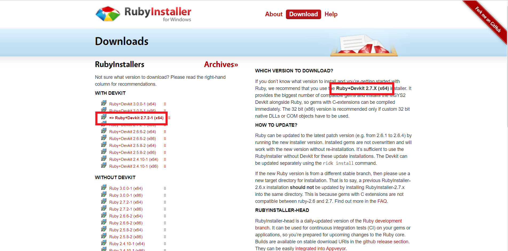
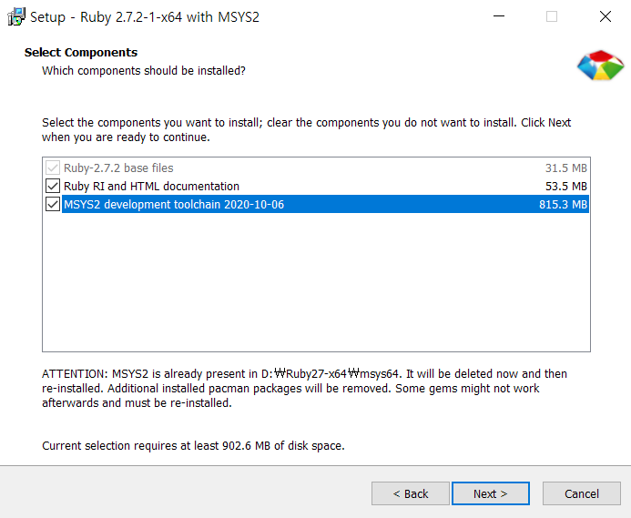
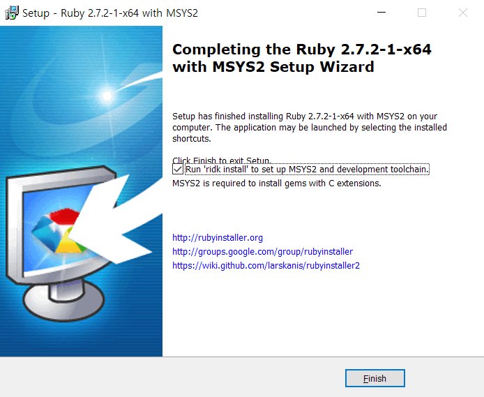
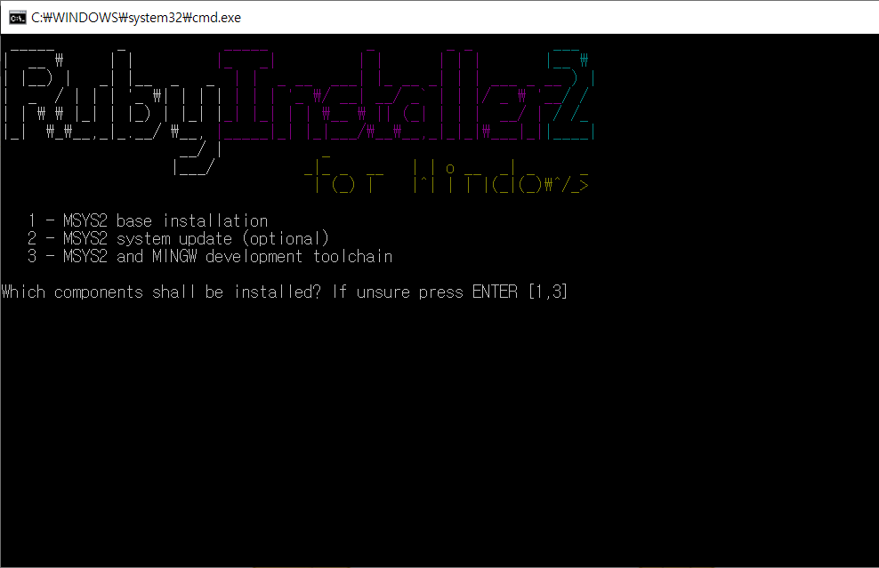
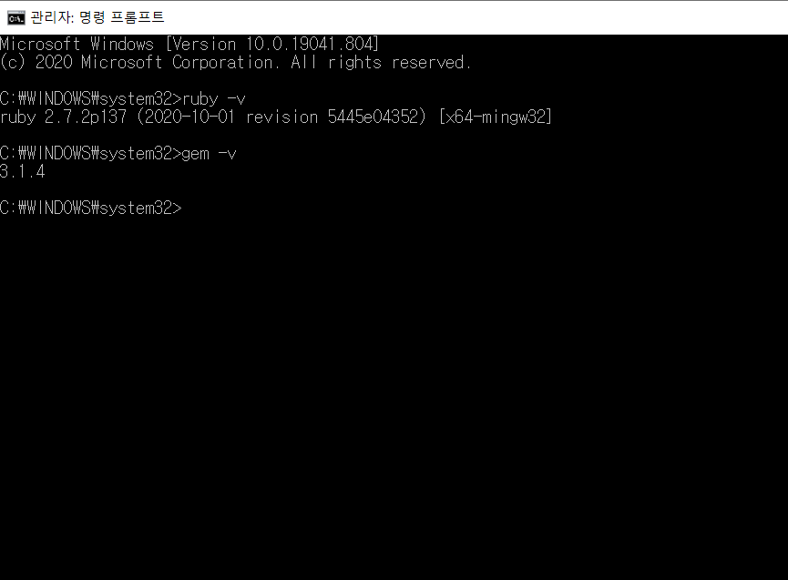
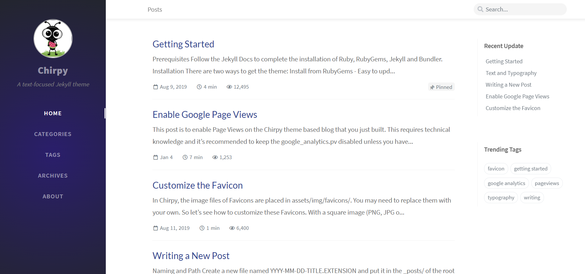
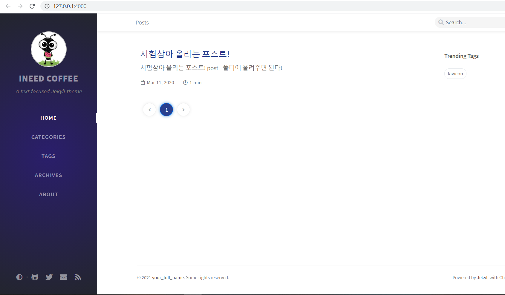

# Github Page 입문을 위한 Jekyll 환경 구축 ( Windows 10)

### :arrow_right: Step1. Download Ruby-installer

[Ruby-installer for windows](https://rubyinstaller.org/downloads/)

>__원하는 버전의 installer를 이용해도 상관없지만, 어떤 버전을 쓸지 잘 모르겠다면 오른쪽에 recommended version 다운!__  

 

​	

### :arrow_right: Step2. Install Ruby & MSYS2

> __체크 가능한 항목은 죄다 체크하고(Path 설정도 꼭 체크) install 하면 된다.__ 
>
> __Ruby 설치가 끝나고 MSYS2 화면까지 왔으면 차례대로 1 -> 엔터 , 2 -> 엔터 , 3 -> 엔터를 누르면 설치 완료__ 
>
> __설치 완료 후 터미널에 `ruby -v`  , `gem -v` 명령어로 잘 설치되었는지 확인__ 

<p>
    
    
    
    
</p>

​	

### :arrow_right: Step3. gem 툴을 이용해 bundler & jekyll download

- pip for python == gem for Ruby

다음과 같은 명령어 순서로 설치

```
ridk enable
chcp 65001
gem install jekyll bundler
bundle install # 테마를 이미 받은 상태가 아니라면 Step4 이후에!
```

​	

__※ 나같은 경우는 윈도우 계정명이 한글이라 Makefile 빌드 과정에서 `C:/User/한글/Local/Tmp` 처럼 한글 포함 경로 때문에 bundler 설치가 저세상이었다.__ 

__그래서 계정을 추가해보고 기존 계정명을 바꿔보고 여러 방법을 시도 해봤는데 `chcp 65001` 이 명령어로 UTF-8 인코딩 옵션을 켜주면 되는 간단한 문제였다 ㅠㅠ__ 

​	

### :arrow_right: Step4. Pick theme pick theme pick theme up

### [Jekyll Themes](https://jekyllthemes.io/) 

​	

> 난 __Chirpy__ 라는 테마가 그나마 내가 설정해줘야 하는것이 많지 않아보여서 선택하였다. [jekyll theme chirpy](https://github.com/cotes2020/jekyll-theme-chirpy)

​	



​	

### :arrow_right: Step5. _config.yml 파일 수정

> 테마마다 지원하는 내용이 모두 다르므로 조금씩 추가 변경이 필요한 항목이 있을 수 있으나 공통적인 부분들만 변경하여도 로컬환경에서 테스트하는데는 문제 없다.


```
# 언어 설정
lang: en-US ==> lang: ko

# 타임존 설정
timezone: Asia/Shanghai ==> timezone: Asia/Seoul

# 블로그,작성자 이름
title: Chirpy ==> title: INEED COFFEE
author: your_full_name ==> author: INEED COFFEE

# 호스팅 URL
url: http://127.0.0.1:4000/ (로컬 테스트라면)
url: https://git-user-id.github.io/ (원격 레포 연결시)
```

​	

### :arrow_right: Step6. Sample Post 

> 이전에 작성했던 아무 마크다운 파일에 다음과 같은 Front-matter 를 추가한다.

```
---
title: 글 제목
author: 작성자
date: YYYY-MM-DD HH:MM:SS +/-TTTT
categories: [상위 카테고리, 하위 카테고리]
tags: [태그]     # 태그명은 항상 소문자로
---
```

​	

> 파일명을 형식에 맞게 변경하고 post_ 폴더에 넣는다.

```
파일 이름 형식 : YYYY-MM-DD-TITLE.md
※ 주의 : TITLE 부분에 - 를 쓰면 띄어쓰기를 적용할 수 있지만 TITLE 자체는 영어명이어야함! 
```

​	

> Terminal 을 열어 다음과 같은 명령어 입력 후 , 로컬 주소에서 적용 확인이 가능하다. [http://127.0.0.1:4000/](http://127.0.0.1:4000/)

```
bundle exec jekyll s
```

​	



​	

### :arrow_right: Step7. Push to remote-repo & build page

> 요고는 로컬에서 조금 더 만져보고 한번에 올릴때 다시 작성 예정


