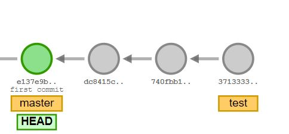
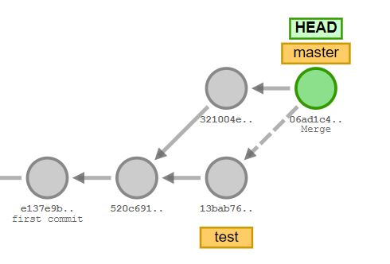

# Git 문법 정리

---


### :arrow_right: init

- 현재 저장소를 git 이 관리할 저장소로 초기화 한다.

```bash
$ git init
```

※ 주의 : 초기화는 가장 상단의 폴더에 , __한.번.만__ 진행한다. 부모/자식 관계의 저장소가 같이 초기화가 진행되면 버전관리에 치명적.

---

 

### :arrow_right: add

- 현재 코드의 상태의 스냅샷을 찍기 위한 파일 선택(== Staging Area에 파일 추가)

```shell
$ git add [파일 이름] # .은 모든 변경 사항을 staging area로 올림
```

---


### :arrow_right: commit 

- 현재 상태에 대한 스냅샷을 `commit`하여, 버전 관리를 진행한다.

```shell
$ git commit -m "커밋 메세지"
```

※ 주의 : commit -a 옵션은 변경사항 전체를 스테이징 후 커밋을 동시에 하지만 __Untracked file__ 에 대해서는 적용할 수 없다.

---


### :arrow_right: remote

- Github 원격(remote) 저장소(repository)를 생성하고 로컬 저장소와 연결한다.
- 새로운 원격 저장소가 추가될 때만 입력한다.

 ```shell
$ git remote add origin [github 원격 저장소 주소]
 ```

---


### :arrow_right: push

- 최종적으로 Github 원격 저장소에 push한다.

```shell
$ git push origin master
$ git push [원격 저장소 지정 이름] [원격 저장소 분기명]
```

※ 참고 : -u 옵션을 활용하면 최초 푸쉬 작업에만 저장소 이름과 분기명을 작성하고 이후에는 git push 만 입력할 수 있다.

---


### :arrow_right: status

- 현재 `git`의 상태를 조회  : 매우매우매우매우 자주 확인하는 습관이 중요 :star:

```shell
$ git status
```

---


### :arrow_right: log

- 버전 관리 이력을 조회

```shell
$ git log
$ git log  --oneline
```

---


### :arrow_right: checkout 

- 현재 분기의 HEAD 를 이동하는 명령으로 특정 시점의 커밋으로 이동하거나 다른 분기의 HEAD 로 이동할 수 있다.

```shell
$ git checkout [커밋 해쉬]  # 특정 시점의 버전으로 이동
$ git checkout [분기명] # 특정 분기로 이동
```

※ 중요 : 원격저장소로부터 pull 작업 시 로컬 저장소에서 같은 분기인지 꼭 확인하고 진행하지 않으면 Git graph 가 엉망이 된다. 협업에서는 아주 중요한 팁이다.

---


### :arrow_right: branch

- 새로운 분기를 만들거나 기존의 분기를 삭제하는 명령

```shell
$ git branch # 현재 저장소의 모든 분기 확인
$ git branch [브랜치명] # 새로운 분기를 생성
$ git branch -d [브랜치명] # 병합이 완료된 특정 분기를 삭제
$ git branch -D [브랜치명] # 병합이 완료되지 않은 특정 분기를 삭제
```

※ 참고 : `git checkout -b [브랜치명]` 의 명령으로 분기를 생성함과 동시에 이동이 가능하다.

※ 주의 : `branch` 는 __절대__ 재활용 하는것이 아니다. 항상 일회성으로 쓴다는 것을 기억하자.

---


### :arrow_right: clone

- 원격저장소의 코드를 복제해오는 명령. git remote 로 연결된 상태면 저장소 이름들은 서로 상이해도 상관없다.

```shell
git clone (저장소 주소)[저장소명] # 저장소명을 생략하면 기존 원격 저장소의 이름으로 생성
```

---


### :arrow_right: merge

- 두 분기를 합치는 명령. `merge` 명령을 수행하는 현재 분기가 기준 분기가 되어 작성한 분기가 기존 분기로 병합된다. 두 분기의 커밋 상태에 따라 3가지 시나리오가 존재한다.

```shell
$ git merge [현재 분기로 합쳐질 분기명]
```


___시나리오1 : Fast-Forward merge___

- 주 브랜치의 헤드가 빨리감기 하듯 시리얼하게 이동하기만 하는 병합 시나리오
- 추가 커밋이 생성되지 않음



___시나리오2 : Auto merge___

- 실제 분기가 일어난 두 브랜치를 병합하는 시나리오
- 두 분기의 헤드 부분 커밋들을 합치는 새 커밋이 새로 생기며 주 브랜치의 헤드가 이동함



___시나리오3 : merge conflict___ :skull:

- 두 분기에 같은 파일/폴더에 대한 커밋이 존재하며 그 내용이 다를때 병합을 시도하면 Git 은 모호한 병합을 진행할 수 없음.
- 사용자가 직접 >>>> branch1 , <<<<branch2 로 명시된 상이한 부분들을 의도에 맞게 확인하여 수정한 뒤에 병합해야 한다.

---


### :arrow_right:항목
