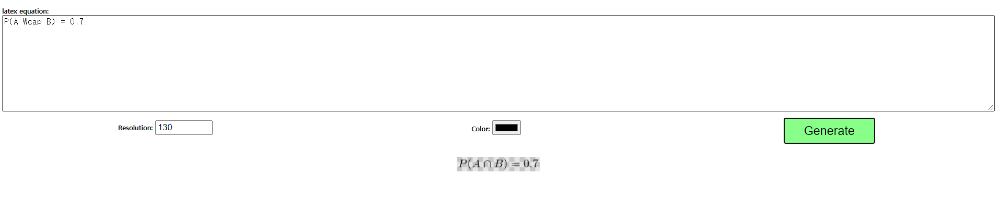
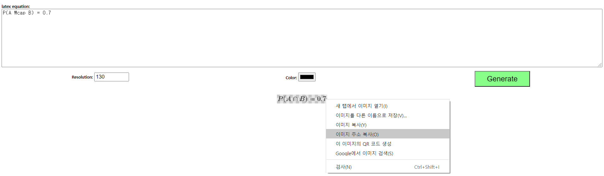

# Git & Github 꿀팁 정리

### :arrow_right: Git 입문 참고 자료

[누구나 쉽게 이해할 수 있는 Git 입문](https://backlog.com/git-tutorial/kr/)

### :arrow_right: Git 파일 관리 과정을 시각적으로 볼 수 있는 웹

__ex)__

[git visualizing](https://git-school.github.io/visualizing-git/)

### :arrow_right: 프로필 화면에도 README 파일 추가하기

- 다른 사람들 깃허브를 구경하던 중 이렇게 프로필 화면에도 README 파일이 있는 것을 보았다. 

- 신기해서 찾아보니 특별한거 아니고 본인의 이름과 동일한 레포지토리를 생성하면 저런 `Hi there` :wave: 문구의 README.md 파일을 추가할 수 있다. 물론 내용도 변경가능하고 태그를 활용하여 본인의 여러 SNS 계정 배지를 통해 좀 더 예쁜 프로필을 꾸밀 수 있다!

### :arrow_right: LaTex 로 작성된 수식 Github에서 렌더링하기

- 개념 정리 마크 다운 파일이나 기타 LaTex로 작성된 수식이 포함되어 있는 파일을 깃헙에 올리면 정상적으로 렌더링이 되지 않고 다음과 같이 글자 그대로 렌더링된다. 

$$
P(A \cap B) = 0.7
$$

- 이를 깃헙에서 정상적으로 수식으로 렌더링되도록 하기 위한 여러 LaTex-to-image convert 웹 사이트들이 있는데 그 중 [http://latex2png.com/](http://latex2png.com/) 이곳에서 변환하는 것이 가장 덜 번거로웠다.
- 사이트에 들어가 LaTex 문법에 따라 수식을 작성하고 `Generate` 버튼을 누르면 다음처럼 변환된 이미지가 하단에 뜨게 되는데,

- 변환된 이미지의 주소를 마크다운에 적용시키면 Github에서도 정상적으로 렌더링 된다!

	
		
			
				

​	

### :arrow_right:항목

### :arrow_right:항목

