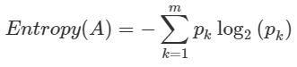
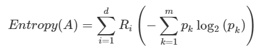
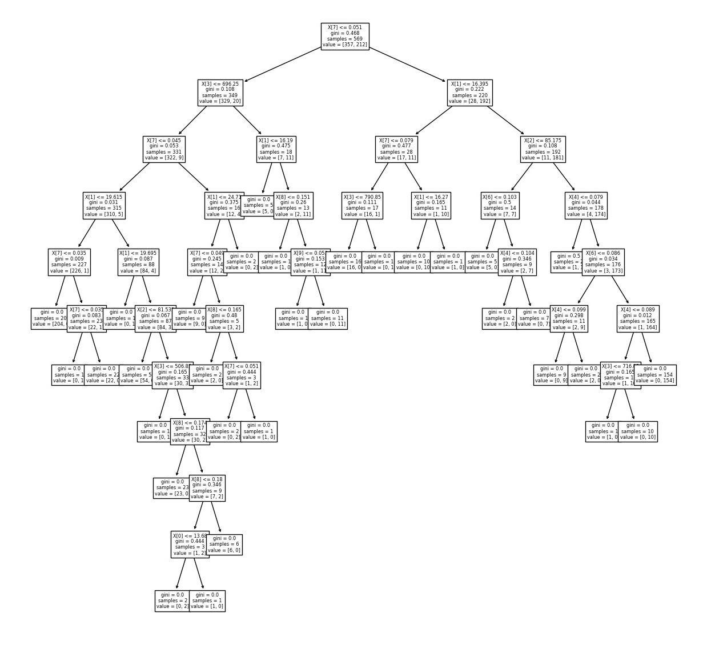

# :mag: Index

- [의사결정나무(Decision Tree)는 뭘까?](#idx1) 
- [의사결정나무의 철학: Information Gain](#idx2) 
- [의사결정나무의 종류 : Type of Tree](#idx3)
- [의사결정나무의 학습과정: Learning Process](#idx4) 
- [sklearn 라이브러리를 활용한 의사 결정나무](#idx5)
- [참고자료](#idx6)

---

### :radio_button: 의사결정나무(Decision Tree)는 뭘까?  <a id="idx1"></a>


의사결정나무란 데이터 사이 존재하는 __패턴__ 을 찾아 이 규칙들의 __조합__ 으로 예측 모델을 만드는데 쓰이는 알고리즘으로 기계학습의 기초가 되는 알고리즘 중 하나이다.


그림으로 그렸을때 트리의 형태를 이루기 때문에 '나무' 라는 말이 붙었는데 이는 추후 여러 의사결정나무를 앙상블 기법을 통해 활용한 __Random Forest__ 알고리즘에도 영향을 주었다.


의사결정나무는 설명변수를 __\*하나씩만\*__ 활용하여 가지뻗기를 진행하는데 이는 우리가 어릴적 한번씩 해봤던 '스무고개' 놀이를 통해 이해할 수 있다. 

> 의사결정나무에 대한 설명을 보면 `설명변수`라는 용어가 쓰이는데 `입력특성`,`독립변수` 정도로 이해하면 된다.


[이미지 출처](https://www.google.com/url?sa=i&url=https%3A%2F%2Fbrunch.co.kr%2F%40kakao-it%2F157&psig=AOvVaw1D35xHZ-Geohyk-iCIprD-&ust=1601041536507000&source=images&cd=vfe&ved=0CAIQjRxqFwoTCIDxttT2gewCFQAAAAAdAAAAABAX)


다음과 같은 스무고개 놀이를 했을 때 __`다리`__ ,__`고양이와 크기가 비슷`__ , __`바다에 사는`__ 은 모두 위에서 언급한 설명변수에 해당한다. 데이터에 대한 패턴을 찾아 트리 구조로 규칙을 조합해놓은 모양이다. 한번에 설명변수 하나씩만을 이용해 가지를 뻗게되어 __terminal node__ , __leaf node__ 라고 부르는 트리의 최하위 항목들을 살펴보면 초기 데이터의 상호 베타적인 집합으로 분류되어 있는것을 확인할 수 있다.


의사결정나무는 이런 모양으로 규칙을 조합하여 데이터에 대한 예측 모델을 이룬다. 이는 `분류(Classification)` 문제와 `회귀(Regression)` 문제 모두 적용가능한데 , 분류 문제의 경우 해당 데이터가 최종적으로 속한 최하위 그룹의 최빈값을 예측값으로 활용하고 회귀 문제의 경우 그 그룹내 데이터의 평균값을 예측값으로 활용한다.즉, N개의 최하위 노드를 갖는 의사결정나무로부터 얻을 수 있는 예측값의 종류는 `분류|회귀 문제와 상관없이 동일하게 최대 N개이다.`

---

### :radio_button: 의사결정 나무의 철학: Information Gain <a id="idx2"></a>

앞에서 언급한 스무고개 놀이를 하는데 만약 첫 질문에 __'혹시 매운 음식인가요?'__ 라고 물었는데 __'네'__ 라는 결과가 나온다면 우리는 __'나이스!'__ 를 외칠것이다. 왜일까?


이는 우리가 고려해야하는 정답 후보 데이터가 아주 세부적으로 바뀌었기 때문이다. 의사결정나무에서는 이를 __`정보획득(Information Gain)`__ 이라 부른다. 정확한 의미는 의사결정나무에서 분기가 일어날때 데이터의 순도 변화량을 정보획득이라 부른다. 데이터의 __순도(homogeneity)__ 란 말 그대로 데이터가 얼마나 단조로운/변화가 많은 혹은 종류가 적은/많은가 정도로 이해하면 되는데 이와 반대되는 개념으로 __불순도(impurity)__ 를 통해 정보획득을 분기 전후의 불순도 감소정도로 설명하기도 한다.


> 방금 정보획득을 순도의 증가량 , 불순도의 감소량 이라는 표현을 통해 설명하였는데 그러면 이는 수치적으로 어떻게 표현될까?


순도,불순도를 수치로 나타내기 위한 종류는 대표적으로 3가지가 있다. 바로 `Entropy` , `Gini Index` , `Misclassification Error` 인데, 이 중 `Entropy` 지표에 대해 알아보자면 다음과 같은 식으로 정의된다.



초기 m 개의 분류를 가진 데이터에 대해서는 위의 식 처럼 각 분류의 확률과 확률의 로그값을 모두 더한 값이 초기 엔트로피 값이다. 이 상태에서 데이터나 나뉘게 되면 다음과 같은 방식으로 엔트로피를 구하게 된다.



각 나뉜 각 그룹에 대해 엔트로피를 구한 다음 그룹의 상대 부피인 R 값을 곱하여 다시 더하는 식이다. 

 

의사결정나무의 학습방법에서 핵심은 저 엔트로피 지수가 낮아지는 쪽으로 분기를 하는것이다.

---

### :radio_button: 의사결정나무의 종류 : Type of Tree <a id="idx3"></a>

위에서 언급한 3가지 대표 지표 외에도 불순도를 측정하는 다양한 척도와 계산 법이 존재하는데 이는 종속변수의 성격이 연속형인지 범주형인지에 따라 나뉘며 이에 따라 다양한 형태의 의사결정나무가 존재한다. 아래는 각 형태의 간략한 설명이다. 가장 많이 쓰이고 있는 모델은 CART 모델이다.

|       | 범주형 종속변수 | 연속형 종속변수 |
| :---: | :-------------: | :-------------: |
| CHAID | 카이제곱 통계량 | ANOVA F-통계량  |
| CART  |    지니지수     |   분산감소량    |
| C4.5  |  엔트로피지수   |                 |


1. __CART (Classification and Regression Tree)__
   - 가장 널리 쓰이는 의사결정나무 알고리즘. 범주형 종속변수에 대해서는 지니지수를 기준으로 분기가 일어나고 연속형 종속변수에 대해서는 분산을 활용한 이진분리가 기준이 된다. :star:
2. __C4.5__
   - 각 노드에서 다중분리(multiple split)가 가능하다는 것이 특징이다. 범주형 종속변수의 학습에만 활용되는 알고리즘으로 엔트로피 지수를 통해 분기가 일어난다.
3. __CHAID (CHi-sqaured Automatic Interaction Detection)__
   - 다른 알고리즘과 달리 `*Full Tree` 를 만족할 때까지 분기가 일어나지 않고 적당한 크기에서 분기를 중단하는것이 특징이다. 분기 기준으로는 카이제곱 통계량을 활용하고 독립변수는 범주형 데이터여야 한다는 특징 또한 가지고 있다.

`*Full Tree`  : 모든 leaf_node 의 순도가 100% 인 나무 모델을 말한다.

---

### :radio_button: 의사결정나무의 학습과정 :  Learning Process<a id ="idx4"></a>

의사결정나무의 학습과정은 신경망 모델의 1회 학습과정과 시각적으로 유사하다. 2 단계를 거쳐 모델이 생성되는데 바로 __`재귀적 분기(recursive partitioning)`__ 와 __`가지치기(pruning)`__ 이다.


계산과정과 함께 이해하기 위해 다음과 같은 샘플 데이터를 생각해보자.

| A(독립) | B(독립) | C(종속) |
| ------- | ------- | ------- |
| 16.6    | 2       | YES     |
| 5.4     | 3       | NO      |
| 20      | 3       | YES     |
| 43.6    | 3       | YES     |
| 5       | 2       | NO      |
| 12      | 3       | YES     |
| 12.7    | 2       | NO      |
| 17.5    | 2       | NO      |


A,B 의 독립 변수에 의해 C의 종속변수 값이 정해지는 데이터일때,

 

__1. 재귀적 분기 (Recursive Partitioning)__

먼저 해당 데이터에 대해 분기가 일어난다. 

초기 엔트로피 값은

`YES` : -(4/8) * (log(4/8)) = 0.5

`NO` : -(4/8) * (log(4/8)) = 0.5 

로 0.5 + 0.5 = 1 이다. (엔트로피 지수에서 최대 값이 1이다. 즉 가장 불순도가 높은 유형이 범주 수만큼 나뉘어 있는 데이터)


이때 , 독립 변수 하나를 고정하여 그 값으로 정렬을 한다. (A 기준이라면)

| A(독립) | B(독립) | C(종속) |
| ------- | ------- | ------- |
| 5       | 2       | NO      |
| 5.4     | 3       | NO      |
| 12      | 3       | YES     |
| 12.7    | 2       | NO      |
| 16.6    | 2       | YES     |
| 17.5    | 2       | NO      |
| 20      | 3       | YES     |
| 43.6    | 3       | YES     |


정렬이 끝나면 총 8개의 데이터가 위에서부터 1:7 , 2:6 , 3:5 , ... 의 비율로 분기될때 엔트로피를 계산하여 정보획득을 계산한다.

`ex) 1:7` 

`1` : 1/8(데이터 비율) * {-1*log(1)} = 0  (데이터가 한 범주에 대해서만 존재하므로)

| A(독립) | B(독립) | C(종속) |
| ------- | ------- | ------- |
| 5       | 2       | NO      |

`2` : 7/8(데이터 비율) * {-4/7 * log(4/7)  +  -3/7 * log(3/7)} (각각 YES , NO 데이터 항목)  ≒ 0.5649

| A(독립) | B(독립) | C(종속) |
| ------- | ------- | ------- |
| 5.4     | 3       | NO      |
| 12      | 3       | YES     |
| 12.7    | 2       | NO      |
| 16.6    | 2       | YES     |
| 17.5    | 2       | NO      |
| 20      | 3       | YES     |
| 43.6    | 3       | YES     |

`분기 후 엔트로피` = 0 + 0.5649 = 0.5649

∴ `정보 획득` = 1 - 0.5649 = 0.4251


위와 같은 작업을 __`모든 독립변수`__ 에 대해서 __`모든 비율`__ 로 분기될때를 계산하여 가장 정보획득이 가장 큰 조건을 택해 분기하는 것이다.

> wow ! 난 여기서 가장 와닿았다.


그럼 그 다음 분기는 어떻게 일어날까?


예를 들어 위 데이터가 A 변수를 위에서부터 3:5 로 분할하여 분기할때 가장 정보획득이 커 Left 그룹과 Right 그룹으로 나누었다고 하자. 그럼 이후에는 Left 그룹의 3개 데이터로 모든 최하위 그룹이 순수 노드가 될때까지 즉, 'YES' 혹은 'NO' 의 데이터만 가지고 있는 그룹이 될 때까지 Left - Left , Left - Right , ... 나누고 작업이 끝나면 처음 나누었던 Right 그룹에 대해 같은 방식으로 분기가 일어난다. 이 때문에 분기 과정 앞에 __`재귀적`__ 이라는 말이 붙는다.


__2. 가지치기 (pruning)__

 분기 작업이 모두 끝나면 이후에는 가지치기 작업이 일어난다. 가지치는 직관적의미 그대로 수 많은 가지로 분기하여 여러 leaf 노드를 가지고 있는 나무의 상위 노드에서 가지를 쳐내며 일부 데이터를 병합하는 과정이다.


[이미지 출처](https://www.google.com/url?sa=i&url=https%3A%2F%2Falanjeffares.wordpress.com%2Ftutorials%2Fdecision-tree%2F&psig=AOvVaw0DujziE98KAzAU4_qLs720&ust=1601217782278000&source=images&cd=vfe&ved=0CAIQjRxqFwoTCKi6uJ2Hh-wCFQAAAAAdAAAAABAK)


> 순수 노드인 최하위 데이터들을 병합하여 상위 노드를 최하위 노드로 만들면 더이상 순수 노드가 아닐텐데 왜 이와 같은 작업을 하는것일까? 


이유는 바로 __과적합( Over-Fitting)__ 을 방지하기 위해서이다. 과대적합에 대한 내용은 또 별도로 정리할 예정이니 간단하게 설명하자면,


모델에서 과적합이 발생했다는 의미는 학습 데이터에 너무도 정교하고 세세하게 학습을 완료해서 학습에 쓰였던 데이터를 입력으로 받게 되면 높은 정확도/예측률 을 가지지만 비슷한 새 데이터에 대해서는 참담한 성능을 보이는 __`일반화 성능`__ 이 꽝이 되었다는 의미이다.


가지치기의 과정도 분기 과정과 비슷하게 그 기준인 __`비용함수 (Cost Fucntion)`__ 의 정도를 모든 분기점에 대해 조사한 후 손실이 가장 적은 분기점을 병합하는 식인데 `TOP-Down` 방식과 `BOTTOM-Up` 방식이 있다.


__※ 참고 비용함수 (Cost Function) 의 표현 식__

의사결정나무 모델 DT 에 대해 

__`CC(DT) = E(DT) + α X L(DT)`__

- CC : Cost Complexity , 최종 비용
- E : Error , 해당 분기를 가지치기 하였을 때 , 트레이닝/학습 misclassification error
- α : 정규화 상수 ( 사용자에 의해 0.1~0.01 정도의 값으로 설정됨)
- L :  Leaves , 모델의 최하위 노드의 수


---

### :radio_button: sklearn 라이브러리를 활용한 의사 결정나무<a id ="idx5"></a>


:pencil2: __의사 결정나무 객체 생성__ 


```python
from sklearn.tree import DecisionTreeClassifier
from slkearn.tree import DecisionTreeRegressor

DT_C = DecisionTreeClassifier()
DT_R = DecisionTreeRegressor()
```


> __세부 옵션__ : 

- `criterion` : 분기의 기준에서 쓰일 지표를 설정.
  - Classifier : 'gini' (지니 계수 , 'entropy' (엔트로피 지수)
  - Regressor : 'mse' (mean-squared-error) , 'mae' (mean-absolute-error)

- `max_features` : 트리 구성에 쓰일 설명변수의 수를 설정 (int, float, None, Auto)
- `max_depth` : 트리의 최대 깊이를 설정. 
- `min_samples_split` : min_samples_leaf 와 혼동 주의. 현재 노드가 분기를 하기에 최소로 만족해야하는 샘플 수를 설정. 이 파라미터 값 이하의 수를 가진 노드는 분기 고려대상 바로 제외
- `min_samples_leaf` : 분기가 일어날 때 하위 노드에 각각 최소로 포함되어야 하는 데이터 수를 설정. 만약 2라면 왼쪽 노드에도 최소 2개, 오른쪽 노드에도 최소 2개의 데이터가 포함되는 조건으로 분기가 일어나야함.
- `random_state` : 트리의 구성에서 무작위한 고려가 필요시 이용되는 파라미터. 예를 들어 max_feature 를 설정해 놓아서 각 분기마다 어떤 설명변수를 골라 criterion을 조사할지 , criterion을 조사했는데 완전히 동일한 둘 이상의 설명변수가 존재할 때 어느 설명변수를 기준으로 분할할지 등. 


:pencil2: __의사 결정나무 객체 학습__ 

```python
model_c = DT_C.fit(xdata,ydata,sample_weight)
model_r = DT_R.fit(xdata,ydata,sample_weight)
```


> 파라미터 세부내용

- xdata : 학습데이터의 입력값
- ydata : 학습데이터의 출력값
- sample_weight : optional 파라미터로 각 설명변수의 가중치 배열을 전달 가능. 분기 조사 과정에서 적용된다.


:pencil2: __의사 결정나무 객체 예측/분류__ 

```python
predict_C = model_C.predict(xtest)
predict_R = model_r.predict(xtest)
```


> 참고

예측 분류/값 에 대해 __배열__ 형태로 반환받는다.


:pencil2: __의사 결정나무 객체 평가__ 

```python
score_c = model_c.score(xtest,ytest,sample_weight)
score_r = model_r.score(xtest,ytest,sample_weight)
```


> 각 문제별 평가기준

- `분류(classification)`
  - 단일 레이블의 경우 ACC (정확도) 를 기준으로 0~1 사이 값으로 평가
  - 다중 레이블의 경우 각 레이블의 ACC 값의 평균으로 평가한다.

※ 다중 레이블은 ydata 의 컬럼이 2 이상인 데이터이다.

- `회귀(Regression)`
  - __R2__ 라고 많이 표현하는 결정계수를 평가 지표를 활용한다. 모든 데이터를 평균치로 예측하는 단순 모델(Zero-R)과 비교하였을 때 얼마나 개선된 성능을 보이는지를 구하는 결정계수의 값 또한 ACC 와 마찬가지로 0~1 사이의 값을 가진다.


:pencil2: __의사 결정나무 기타 기능__ 


- :bulb: __sklearn.tree 서브패키지의 plot_tree__

의사결정나무 객체를 전달하면 현재 학습이 완료된 객체의 모습을 시각화하여 볼 수 있다.

```python
from sklearn.tree import plot_tree as pt
import matplotlib.pyplot as plt
fig , ax1 = plt.subplots(nrows=1)
fig.set_size_inches(20,20)
tree_picture = pt(model,ax=ax1)
```



---


### :radio_button: 참고 자료 <a id="idx6"></a>

- [의사결정나무(Decision Tree) by ratsgo](https://ratsgo.github.io/machine%20learning/2017/03/26/tree/)
- [의사결정나무 by chocoma](https://freedata.tistory.com/38)

