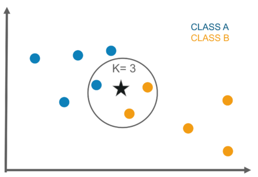

# :mag: Index

- [k-최근접 이웃 알고리즘 이란? (KNN)](#idx1) 

- [k-최근접 이웃 알고리즘의 동작 원리](#idx2) 

- [k-최근접 이웃 알고리즘의 장단점](#idx3)

- [sklearn 패키지를 활용한 KNN](#idx4) 

- [참고자료](#idx5)

  

---

### :radio_button: k-최근접 이웃 알고리즘 이란? (KNN) <a id="idx1"></a>

​	

`K - Nearest Neighbors , K- 최근접 이웃 알고리즘` 이란 <u>\* 데이터 분류 작업</u> 에서 활용되는 기초가 되는 알고리즘이다. 

​	

새로운 입력으로 들어온 데이터를 특정값으로 분류하는데 현재 데이터와 가장 가까운 k개의 데이터를 찾아 가장 많은 분류 값으로 현재의 데이터를 분류하는 알고리즘이다.

​	

아래는 k-최근접 이웃 알고리즘의 이해를 돕기 위한 사진이다.

<p align="center">

</p>

​	    

```
* 가장 가까운 3개의 기존 데이터의 분류를 살펴본 결과 , B분류가 2개 A분류가 1개이므로 새로운 데이터 '별' 은 B분류로 할당
```

​	

※ 데이터 분류란 새로운 데이터를 기존 데이터의 레이블 중 하나로 분류하는 작업을 의미한다.

​	

---

### :radio_button: k-최근접 이웃 알고리즘의 동작 원리 <a id="idx2"></a>

​	

>  `가장 가까운` 이라는 개념은 현실 세계와 같은 3차원 좌표값이 아닌 3이상의 N차원의 일반적인 데이터에 대해서는 어떻게 정의할까?

​	

사실 3차원 이상의 데이터는 우리 눈으로 확인 가능한 형태로 표현할 수 없을 뿐 , 거리의 계산은 동일하게 벡터 공간에서 두 벡터의 유클리디안 거리를 기반으로 가깝고 멀다는 것을 구분하면 된다.

​	

(x1,x2,...,xn) 의 값을 가지는 데이터와 (y1,y2,...,yn) 의 값을 가지는 데이터 사이 거리는 다음과 같이 나타낸다.


<p align="center">

</p>
​		

---

### :radio_button: k-최근접 이웃 알고리즘의 장단점 <a id="idx3"></a>

​	

__pros__ 

- 당연하지만 , 우선 정말 간단하다. 선수 지식을 필요로하지 않는다.
- 숫자로 구분된 속성에 우수한 성능을 보인다. 거리, 횟수 , 점수와 같은 수치형 레이블에 대해서 높은 정확도를 기대할 수 있다.
- `Lazy learning` 의 특성이 있다. 즉 실제 예측 시점에서 계산을 진행하기 때문에 별도의 모델이 사전 학습을 할 필요가 없다.
- 이진 분류는 물론 , 다중 분류의 경우에도 적용할 수 있다.

  

__cons__ 

- pros 3번의 trade-off 로 연산 (or 예측) 속도가 다른 알고리즘에 비해 아주 느리다.

- 하나의 예측 (or 분류)  를 진행할 때마다 전체 데이터와 비교를 진행하기 때문에 데이터 차원에 따라 연산 속도가 크게 늘어난다.

- 다른 알고리즘에 비해 데이터의 편향성 , 이상치에 대해 민감하다. 

- 적절한 K값을 찾는것이 관건

  

---

### :radio_button: sklearn 패키지를 활용한 KNN <a id="idx4"></a>

​	

:pencil2: __k-최근접 이웃 객체 생성__ 

```python
from sklearn.neighbors import KNeighborsClassifier
from sklearn.neighbors import KNeighborsRegressor

knn = KNeighbors(n_neighbors=k)
```

​	

> __세부 파라미터__ :

- `n_neighbors` : 몇개의 최근접을 조사하여 데이터 분류를 할지 지정하는 옵션. 하나의 파라미터만 존재하므로 최적의 k 값을 찾는것이 중요하다. (k 의 변화에 따른 cross_val_score 그래프를 그리는 것이 일반적)


​	

:pencil2: __k-최근접 이웃 객체 학습__ 

```python
knn.fit(xdata,ylabel)
```

​	

> __세부 내용__ :

- xdata 는 벡터 공간의 실제 데이터 벡터들로 이루어져있고 ylabel 은 각 데이터의 분류 값이다.
- 다른 알고리즘 처럼 실제 학습이 이루어지진 않고 predict 메소드가 실행됨에 따라 xdata 전체 데이터와 조사가 진행된다.


​	

:pencil2: __k-최근접 이웃 객체 예측__ 

```python
knn.predict(xtest)
knn.predict_proba(xtest)
```

​	

> __세부 내용 :__ 

- 새로운 입력 xtest 에 대하여 k 개의 최근접을 조사하고 데이터 분류를 진행

- predict의 경우 최빈 , 혹은 과반수 이상인 레이블 값 하나를 반환하고 predict_proba 의 경우 각 분류 카테고리에 속할 확률들을 반환한다.

  

---


### :radio_button: 참고자료 <a id="idx5"></a>

- [나의 첫 머신러닝/딥러닝](https://wikibook.co.kr/mymlrev/) Chapter 4.2 


