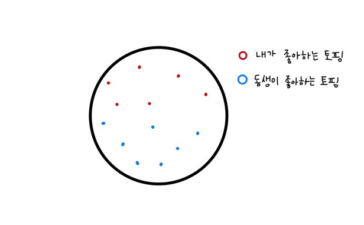
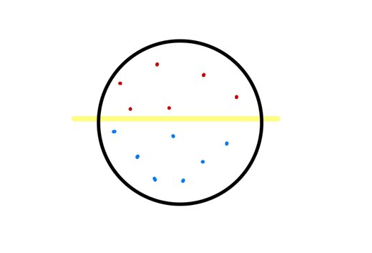
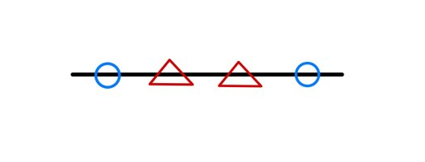
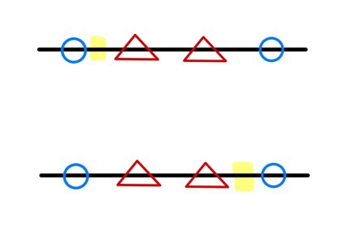

# :mag: Index

- [서포트 벡터 머신이란?](#idx1) 
- [서포트 벡터 머신의 구성 요소](#idx2) 
- [서포트 벡터 머신의 꽃 : 커널 트릭](#idx3)
- [서포트 벡터 머신의 장단점 ](#idx4) 
- [sklearn 패키지를 활용한 SVM](#idx5)
- [참고자료](#idx6)

---

### :radio_button: 서포트 벡터 머신이란? 

​	

서포트 벡터 머신(Support Vector Machine)이란 , 

`결정 경계선` 을 통해 데이터를 분류하는 머신러닝 알고리즘으로 나이브 베이즈 모델과 함께 간편하면서도 높은 성능을 자랑하는 머신러닝 알고리즘의 양대산맥이라 할 수 있는 데이터 분류 알고리즘이다.

​	

주로 이진분류 문제에 많이 쓰이지만 `1 vs.all` , `1 vs. 1` , `some vs. some` 과 같은 다중분류로 확장 가능한 방법들도 존재한다.

​	

---

### :radio_button: 서포트 벡터 머신의 구성 요소 

​	

서포트 벡터 머신은 __결정 경계__ 라 불리는 `Decision Boundary`  를 통해 독립변수들이 이루는 벡터 공간을 둘로 분할하여 각 공간에 속한 데이터들을 다른 레이블로 분류하는 알고리즘이다. 

​	

알고리즘의 이름도 , 결정 경계라는 구성 요소명도 직관적이지 않아 전혀 이해가 되지 않을 수 있지만 말로 풀어 예시를 적용해보면 사실 생각보다 상당히 간단하다.

​	

>  나와 내 동생이 피자를 나눠먹는데 서로 좋아하는 토핑이 달라 피자를 반으로 나눠서 먹으려한다 생각해보자.  

 

>  그럼 우리가 어떤 심오한 수학적 계산을 머리속에 그리지 않도고 우리는 피자를 이렇게 나눌것이다.

 

> 좋아하는 토핑은 섞이지 않으며 어느 한쪽으로 치우지지 않도록 !

이것이 사실 서포트 벡터 머신의 핵심 개념이다. 위 그림에서 노란선으로 표시된 선이 서포트 벡터 머신을 구성하는  중요 요소 주 하나인 __결정 경계__ 이고 서포트 벡터 머신은 최대한 어느 한 영역에 치우치지 않도록 결정 경계를 잘 설정하여 안정적인 분류를 하는 것이 목표인 알고리즘인 셈이다.

​	

그렇다면 , 결정 경계를 잘 설정하기 위해서는 어떤 과정이 필요할까?

​	

이 과정을 이해하는데 있어 등장하는 다음 요소가 __서포트 벡터__ 와 __마진__ 이다.

`서포트 벡터` 란 결정 경계와 근접해있는 데이터 포인트들을 의미하고 , `마진` 은 이러한 서포트 벡터들과 

결정 경계 사이 거리를 의미한다.

​	

위 피자 예시에서의 서포트 벡터들과 마진은 다음과 같다.

 

---

### :radio_button: 서포트 벡터 머신의 꽃 : 커널 트릭 

​	

하지만 모든 경우가 위와 같은 선형적인 결정 경계선 , 혹은 결정 경계면에 의해 원활히 데이터 분류 작업이 이루어지진 않는다.

다음과 같은 1차원 상의 데이터 벡터들을 분류하는 상황을 가정해보자.

​	

 

​	

이런 작업의 경우 선형 SVM 모델을 활용하고자 한다면 N-1 차원인 0차원 , 즉 하나의 점을 기준으로 데이터를 분류해야 하는데 

어느 지점을 기준으로 잡더라 하더라도 제대로된 분류가 가능한 지점이 존재하지 않는다.

​	

 

​		

이러한 선형 서포트 벡터 머신의 한계점을 극복하고자 도입된 방법이 바로 __커널트릭__ 이다.

커널 트릭이란 , N차원의 벡터 정보를 N+1 이상의 차원으로 확장하여 N차원 이상의 결정 경계면 

---

### :radio_button: 서포트 벡터 머신의 장단점 

​	

이와 같은 서포트 벡터 머신의 장단점에 대해 정리해보자면 다음과 같다.

​	

>__Pros__ 

- 커널트릭 기법을 활용하여 N차원의 특성을 가진 데이터를 N차원 혹은 그 이상의 데이터로 맵핑하여 데이터 분류 작업이 가능하다.

- over-fitting , under-fitting 을 방지하기 위한 하이퍼 파라미터 종류가 적으며 직관적이다.

- 학습 데이터 사이즈에 비해 성능이 우수하다. 데이터의 특성이 잘 구분되어 있는 성격의 데이터의 경우 작은 학습 데이터로도 딥러닝 모델만큼의 분류 성능을 기대할 수 있다.

  

> __Cons__ 

- 데이터의 전처리가 다른 알고리즘에 비해 중요하다. 편향 정도가 심한 데이터의 경우 높은 마진을 기대하기 힘든 서포트 벡터를 통해 결정 경계가 만들어질 확률이 높다.
- 선형 , 비선형 모델 모두 3차원 이상의 특성을 가지는 데이터에 대해 결정 경계를 시각화하기 힘들기 때문에 수학적인 동작 이해가 바탕이 되지 않은 상태에서는 SVM의 분류 결과를 이해하기 힘들다.

---

### :radio_button: sklearn 패키지를 활용한 SVM 

***

### :radio_button: 참고자료 

- [나의 첫 머신러닝/딥러닝](https://wikibook.co.kr/mymlrev/) Chapter 4.3

- svm의 다중분류?
- 커널트릭을 활용해도 어쨋든 선형 분리인건지? , 비선형 svm 모델이란?
- 내부적으로 결정 경계에 해당하는 선형식의 계수가 어떻게 업데이트 되는지?