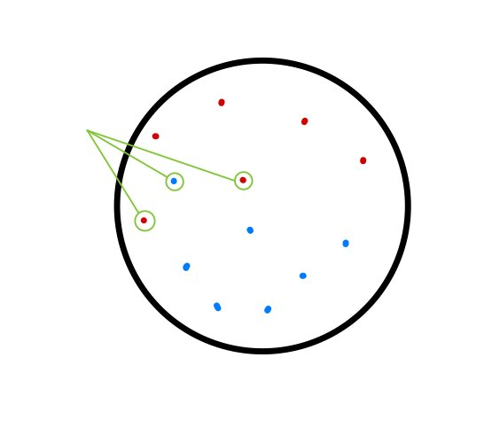

# :mag: Index

- [서포트 벡터 머신이란?](#idx1) 
- [서포트 벡터 머신의 구성 요소](#idx2) 
- [서포트 벡터 머신의 꽃 : 커널 트릭](#idx3)
- [서포트 벡터 머신의 장단점 ](#idx4) 
- [sklearn 패키지를 활용한 SVM](#idx5)
- [참고자료](#idx6)

---

### :radio_button: 서포트 벡터 머신이란? 

​	

서포트 벡터 머신(Support Vector Machine)이란 , 

`결정 경계선` 을 통해 데이터를 분류하는 머신러닝 알고리즘으로 나이브 베이즈 모델과 함께 간편하면서도 높은 성능을 자랑하는 머신러닝 알고리즘의 양대산맥이라 할 수 있는 데이터 분류 알고리즘이다.

​	

주로 이진분류 문제에 많이 쓰이지만 `1 vs.all` , `1 vs. 1` , `some vs. some` 과 같은 다중분류로 확장 가능한 방법들도 존재한다.

​	

---

### :radio_button: 서포트 벡터 머신의 구성 요소 

​	

서포트 벡터 머신을 구성하는 요소들의 용어부터 먼저 언급하자면 __서포트 벡터__ , __결정 경계__ , __마진__ , __비용__ , +α ( 커널 ) 로 이루어져있다.

​	

먼저 서포트 벡터 머신은 __결정 경계__ 라 불리는 `Decision Boundary`  를 통해 독립변수들이 이루는 벡터 공간을 둘로 분할하여 각 공간에 속한 데이터들을 다른 레이블로 분류하는 알고리즘이다. 

​	

알고리즘의 이름도 , 결정 경계라는 구성 요소명도 직관적이지 않아 이해가 힘들 수 있지만 말로 풀어 예시를 적용해보면 사실 생각보다 상당히 간단하다.

​	

>  나와 내 동생이 피자를 나눠먹는데 서로 좋아하는 토핑이 달라 피자를 반으로 나눠서 먹으려한다 생각해보자.  

 

>  그럼 우리가 어떤 심오한 수학적 계산을 머리속에 그리지 않도고 우리는 피자를 이렇게 나눌것이다.

 

> 좋아하는 토핑은 섞이지 않으며 어느 한쪽으로 치우지지 않도록 !

이것이 사실 서포트 벡터 머신의 핵심 개념이다. 위 그림에서 노란선으로 표시된 선이 서포트 벡터 머신을 구성하는  중요 요소 주 하나인 __결정 경계__ 이고 서포트 벡터 머신은 최대한 어느 한 영역에 치우치지 않도록 결정 경계를 잘 설정하여 안정적인 분류를 하는 것이 목표인 알고리즘인 셈이다.

​	

> 결정 경계는 결국 특성들의 선형식이며 2차원에서는 직선 , 3차원에서는 평명인 셈이다.
>
> ex) x₁ , x₂ , x₃ 의 특성을 가지는 데이터를 분류하는 결정 경계식은 α + β₁x₁ + β₂x₂ + β₃x₃ 꼴이다.

​	

그렇다면 , 결정 경계를 잘 설정하기 위해서는 어떤 과정이 필요할까?

​	

이 과정을 이해하는데 있어 등장하는 다음 요소가 __서포트 벡터__ 와 __마진__ 이다.

`서포트 벡터` 란 결정 경계와 근접해있는 데이터 포인트들을 의미하고 , `마진` 은 이러한 서포트 벡터들과 

결정 경계 사이 거리를 의미한다.

​	

위 피자 예시에서의 서포트 벡터들과 마진은 다음과 같다.

 

> 자세한 설명은 생략하지만 알아두어야 할 점 : N차원 특성을 가지는 데이터에 대해 결정 경계를 만들기 위해서는 최소 N+1 개의 서포트 벡터가 필요하며 만들어지는 결정 경계는 항상 N-1 차원이다.

​	

결정 경계를 잘 설정한다는 것은 위의 `마진` 이 가장 크게 설정한다는 의미이다.

이에 대한 정확한 표현은 서포트 벡터들과 직교성을 유지하는것을 의미하지만 수학적인 자세한 식은 정리에서 생략하도록 한다.

​	

그렇다면 다음처럼 일반적인 결정 경계를 설정하기 힘든 경우에는 어떻게 할까?

 

뒤에 나오는 설명을 보기 전에는 2가지 정도 방법을 예상해볼 수 있다.

 

1. 선형성을 포기하고 비선형적인 결정 경계면을 설정하여 데이터를 정확히 분류한다.
2. __소수의 이상치 데이터를 수용하여__ 선형적인 결정 경계면을 설정하여 데이터를 분류한다.

> 과연 어느 방법이 새로운 데이터가 입력으로 들어왔을때 더 좋은 성능을 보일까?

​	

글자도 강조되어 있어 이미 답을 알지만 실제로 2번의 방법이 1번의 방법보다 훨씬 일반화 성능 측면에서 뛰어나다.

1번의 경우 학습하는 과정에서 학습 데이터에 대해서는 아주 작거나 0에 가까운 오차율을 보이겠지만 실제 일반적인 데이터 입력에 대해서는 제대로 분류하지 못할 가능성이 커진다.

반면 , 2번의 경우 마진을 계산하는 과정에서 __이상치 몇 개__ 는 서포트 벡터 후보에서 제외하여 학습 데이터에 대해서 어느정도 오차는 보이나 새로운 입력에 대해서 꽤 우수하게 분류하는 모델을 만들 수 있어진다.

이때 등장하는 개념이 바로 __비용__ 이다.

비용이란 , 하나의 이상 데이터에 대해서 얼마나 민감하게 반응하는지를 나타내는 지표로 비용이 작을수록 이상치 몇 개 정도에 대해서는 관대한 결정 경계를 설정하게 된다. 또 비용이 높다면 이상치 하나 하나에 민감한 결정 경계가 만들어진다.

​	

앞서 언급한 구성 요소들을 토대로 서포트 벡터 머신의 생성과 동작 과정을 요약하자면 다음과 같다.

1. 모델의 비용을 설정한다.

2. 비용을 토대로 결정 경계를 설정할 서포트 벡터들을 선택한다.

3. 서포트 벡터들과 마진을 최대로 할 수 있는 선형식을 도출한다.

4. 새로운 입력에 대하여 3번의 선형식으로부터 데이터를 이진 분류한다.

   

---

### :radio_button: 서포트 벡터 머신의 꽃 : 커널 트릭 

​	

하지만 어느정도의 비용을 통해서도 위와 같이 선형적인 결정 경계선 , 혹은 결정 경계면에 의해 원활히 데이터 분류 작업이 이루어지진 않는 경우가 존재한다.

다음과 같은 1차원 상의 데이터 벡터들을 분류하는 상황을 가정해보자.

​	

 

​	

이런 작업의 경우 선형 SVM 모델을 활용하고자 한다면 N-1 차원인 0차원 , 즉 하나의 점을 기준으로 데이터를 분류해야 하는데 

어느 지점을 기준으로 잡더라 하더라도 제대로된 분류가 가능한 지점이 존재하지 않는다.

​	

 

​		

이러한 선형 서포트 벡터 머신의 한계점을 극복하고자 도입된 방법이 바로 __커널트릭__ 이다.

커널 트릭이란 , N차원의 벡터 정보를 N+1 이상의 차원으로 확장하여 N차원 이상의 결정 경계를 통해 데이터를 분류하는 기법을 말한다.

 

원래의 개념으로는 차원을 증가시키는 맵핑함수를 통해 2차원 데이터는 3차원으로 , 4차원 데이터는 5차원으로 변환하여 결정 경계를 설정하는 개념이긴 하지만 실제로 많은 양의 데이터의 차원을 증가시키는 연산이 가볍지 않기 때문에 각 데이터 포인트에 대하여 허용 표준 편차를 참조할 수 있는 변형 형태의 맵핑함수를 통해 차원을 증가시키는 것과 동일한 효과를 가능하게 하는 방법으로 구현되어 있다.
이러한 커널 트릭의 종류에도 다양한 맵핑 함수가 있지만 가장 많이 쓰이는 대표적인 함수는 RBF 가우시안 함수이다.

​	

이러한 커널트릭을 사용하여 모델을 생성하려면 하나의 구성요소가 더 추가되는데 바로 __감마(gamma)__ 이다.

​	

감마는 각 데이터에 적용되는 맵핑함수의 표준편차 값을 의미하며 이 값의 증감은 다음과 같은 의미를 가진다.

1. __감마 값의 증가 - 데이터포인트 별 허용 표준편차가 작아짐 - 데이터의 차원 분리가 넓게 일어나며 실제 생성되는 결정 경계는 작고 구부러짐이 심해짐__ 
2. __감마 값의 감소 - 데이터포인트 별 허용 표준편차가 커짐 - 데이터이 차원 분리가 좁게  일어나며 실제 생성되는 결정 경계가 비교적 크며 완만한 곡률을 보임__ 

각 상황에 대해서 그림으로 표현하면 다음과 같이 이해할 수 있다. (조금 과장되게 묘사하면)

  

---

### :radio_button: 서포트 벡터 머신의 장단점 

​	

이와 같은 서포트 벡터 머신의 장단점에 대해 정리해보자면 다음과 같다.

​	

>__Pros__ 

- 커널트릭 기법을 활용하여 N차원의 특성을 가진 데이터를 N차원 혹은 그 이상의 데이터로 맵핑하여 데이터 분류 작업이 가능하다.

- over-fitting , under-fitting 을 방지하기 위한 하이퍼 파라미터 종류가 적으며 직관적이다.

- 학습 데이터 사이즈에 비해 성능이 우수하다. 데이터의 특성이 잘 구분되어 있는 성격의 데이터의 경우 작은 학습 데이터로도 딥러닝 모델만큼의 분류 성능을 기대할 수 있다.

  

> __Cons__ 

- 데이터의 전처리가 다른 알고리즘에 비해 중요하다. 편향 정도가 심한 데이터의 경우 높은 마진을 기대하기 힘든 서포트 벡터를 통해 결정 경계가 만들어질 확률이 높다.
- 선형 , 비선형 모델 모두 3차원 이상의 특성을 가지는 데이터에 대해 결정 경계를 시각화하기 힘들기 때문에 수학적인 동작 이해가 바탕이 되지 않은 상태에서는 SVM의 분류 결과를 이해하기 힘들다.

---

### :radio_button: sklearn 패키지를 활용한 SVM 

***

### :radio_button: 참고자료 

- [나의 첫 머신러닝/딥러닝](https://wikibook.co.kr/mymlrev/) Chapter 4.3

- svm의 다중분류?
- 커널트릭을 활용해도 어쨋든 선형 분리인건지? , 비선형 svm 모델이란?
- 내부적으로 결정 경계에 해당하는 선형식의 계수가 어떻게 업데이트 되는지?