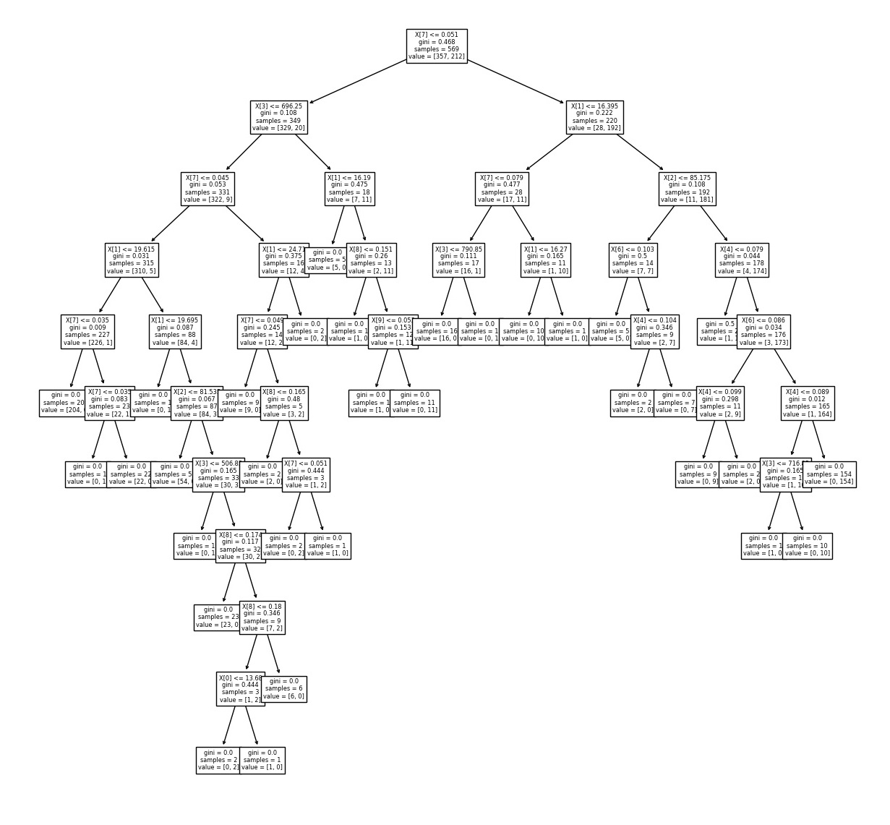

# :mag: Index

- [의사결정나무 객체 생성](#idx1) 
- [의사결정나무 학습](#idx2) 
- [의사결정나무 객체 예측/분류](#idx3)
- [의사결정나무 객체 평가](#idx4) 
- [의사결정나무 객체 기타 기능](#idx5)

---


### :radio_button: 의사결정나무 객체 생성 <a id="idx1"></a>

```python
from sklearn.tree import DecisionTreeClassifier
from slkearn.tree import DecisionTreeRegressor

DT_C = DecisionTreeClassifier()
DT_R = DecisionTreeRegressor()
```


> __세부 옵션__ : 

- `criterion` : 분기의 기준에서 쓰일 지표를 설정.
  - Classifier : 'gini' (지니 계수) , 'entropy' (엔트로피 지수)
  - Regressor : 'mse' (mean-squared-error) , 'mae' (mean-absolute-error)

- `max_features` : 트리 구성에 쓰일 설명변수의 수를 설정 (int, float, None, Auto)
- `max_depth` : 트리의 최대 깊이를 설정. 
- `min_samples_split` : min_samples_leaf 와 혼동 주의. 현재 노드가 분기를 하기에 최소로 만족해야하는 샘플 수를 설정. 이 파라미터 값 이하의 수를 가진 노드는 분기 고려대상 바로 제외
- `min_samples_leaf` : 분기가 일어날 때 하위 노드에 각각 최소로 포함되어야 하는 데이터 수를 설정. 만약 2라면 왼쪽 노드에도 최소 2개, 오른쪽 노드에도 최소 2개의 데이터가 포함되는 조건으로 분기가 일어나야함.
- `random_state` : 트리의 구성에서 무작위한 고려가 필요시 이용되는 파라미터. 예를 들어 max_feature 를 설정해 놓아서 각 분기마다 어떤 설명변수를 골라 criterion을 조사할지 , criterion을 조사했는데 완전히 동일한 둘 이상의 설명변수가 존재할 때 어느 설명변수를 기준으로 분할할지 등. 

---


### :radio_button: 의사결정나무 객체 학습 <a id="idx2"></a>

```python
model_c = DT_C(xdata,ydata,sample_weight)
model_r = DT_R(xdata,ydata,sample_weight)
```


> 파라미터 세부내용

- xdata : 학습데이터의 입력값
- ydata : 학습데이터의 출력값
- sample_weight : optional 파라미터로 각 설명변수의 가중치 배열을 전달 가능. 분기 조사 과정에서 적용된다.

---


### :radio_button: 의사결정나무 객체 예측/분류 <a id="idx3"></a>

```python
predict_C = model_C(xtest)
predict_R = model_r(xtest)
```


> 참고

예측 분류/값 에 대해 __배열__ 형태로 반환받는다.

---


### :radio_button: 의사결정나무 객체 평가 <a id="idx4"></a>

```python
score_c = model_c.score(xtest,ytest,sample_weight)
score_r = model_r.score(xtest,ytest,sample_weight)
```


> 각 문제별 평가기준

- `분류(classification)`
  - 단일 레이블의 경우 ACC (정확도) 를 기준으로 0~1 사이 값으로 평가
  - 다중 레이블의 경우 각 레이블의 ACC 값의 평균으로 평가한다.

※ 다중 레이블은 ydata 의 컬럼이 2 이상인 데이터이다.

- `회귀(Regression)`
  - __R2__ 라고 많이 표현하는 결정계수를 평가 지표를 활용한다. 모든 데이터를 평균치로 예측하는 단순 모델(Zero-R)과 비교하였을 때 얼마나 개선된 성능을 보이는지를 구하는 결정계수의 값 또한 ACC 와 마찬가지로 0~1 사이의 값을 가진다.

---


### :radio_button: 의사결정나무 기타 기능 <a id="idx5"></a>


- :bulb: __sklearn.tree 서브패키지의 plot_tree​__

의사결정나무 객체를 전달하면 현재 학습이 완료된 객체의 모습을 시각화하여 볼 수 있다.

```python
from sklearn.tree import plot_tree as pt
import matplotlib.pyplot as plt
fig , ax1 = plt.subplots(nrows=1)
fig.set_size_inches(20,20)
tree_picture = pt(model,ax=ax1)
```




