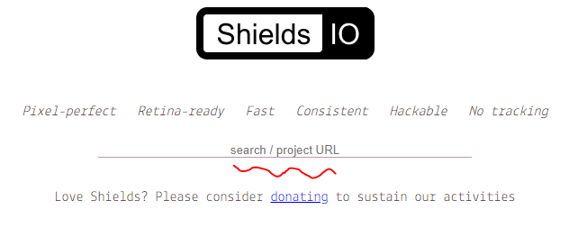
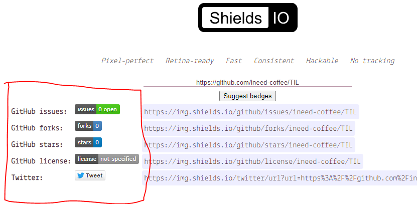
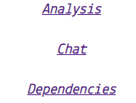
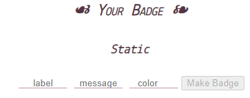

# 마크다운 꿀팁 정리


### :arrow_right: 이모지! (2020.09.18)

다른 사람들 레포짓을 구경 다니면서 신기한 README 파일들을 보았는데 :pen: 이런​ 이모지들을 활용하여 아주 깔끔하고 보기 좋게 작성되어 있는 마크다운 파일들이 많았다.

 

구선생님께 여쭈어보았더니 각 항목들에 붙어있는 저 화살표 같은 이모지를 비롯하여 마크다운에서 작성할 수 있는 이모지 종류가 디이이빵 많더라. `:arrow_left:` 이런식으로 작성하면 자동으로 이모지로 변환되는데 저걸 다 외워서 하는건가? 싶었는데 __당연히!__ 치트 시트가 있더라. 앞으로 괜찮은 이모지가 있으면 마크다운 작성에 있어 다양하게 써먹어봐야겠다.

[이모지 치트 시트 바로가기](https://www.webfx.com/tools/emoji-cheat-sheet/) 

---


### :arrow_right: 문서 내부 특정 내용으로 바로가는 링크! (2020.09.20)

마크다운 문서를 작성하다 보면 생각보다 글이 길어지고 양이 많아지는 문서들이 있다. 이런 문서들의 특정 내용을 나중에 다시 찾아보려 하면 흐름이 쭉 이어지는 글 같은 경우 덜 하지만 이런 병렬로 나열된 내용들이 가득한 문서에서는 찾기가 까다로운 경우가 발생하곤 한다. 그런경우 문서의 시작부분에 문서 내부의 특정 내용으로 이동할 수 있는 링크를 걸어 목록 역할을 글을 작성하여 키워드만 보고 바로바로 내용으로 이동할 수 있다! 

 

마크다운에서 링크를 추가하는 방식인 `[표시될 텍스트](링크 URL)` 에서 __링크 URL__ 부분을 `#문서에 쓰인 글자` 로 작성하면 된다! 

__ex)__

[이런식으로](#여기는-페이지-끝입니다) 

※ 주의할 점은 영어로된 내용의 경우 모두 `lower-case` 로 참조해야하고 띄어쓰기는 `-` 를 추가하여 작성해야한다.

---


### :arrow_right: 배지 추가하기 ! (2020.10.30)

여러 오픈소스 프로젝트들 깃허브 저장소에 보면 예쁜 REAME.md 파일과 함께 

이런식으로 프로젝트의 정보를 설명하는 배지들을 본적이 있을 것이다. 

어떻게 하는거지? 하고 궁금하긴 했는데 생각보다 방법이 쉬워서 짧게 정리해둬야겠다.

[https://shields.io/](https://shields.io/) 페이지에 들어가보면 이러한 배지 태크링크를 생성할 수 있게끔 되어 있다.

 

먼저 페이지 가장 상단에 본인의 특정 깃허브 레포 주소를 입력하는 공간이 있는데 , 

이곳에 원하는 저장소의 주소를 넣으면 저장소 성격에 따라 배지를 추천해준다.

 

​	

> __요로코롬!__ 


여기서 마음에 드는 배지가 있다면 클릭하여 스타일이나 , 라벨명 변경 등 원하는 커스터마이징도 할 수 있고 , 

최종적으로 URL 을 복사하여 README.md 와 같은 마크다운 파일에 이미지 형식으로 붙여넣으면 바로 적용이 가능하다!

 

​	

 ```

 ```

​	

또 , 추천 배지 이외에도 이미 만들어져있는 배지 프리셋에서 골라 URL을 생성할 수도 있고 , 

아예 라벨명과 내용 , 색상 등 모든 정보를 커스텀으로 새로운 나만의 배지 URL을 만들 수도 있다.

 

​	

 

​	

### :arrow_right: 항목


### :arrow_right: 항목

​	

​	

​	

​	

​	

​	

​	

​	

​		

​	

​	

​	

​	

​	

​	


#### 여기는 페이지 끝입니다
