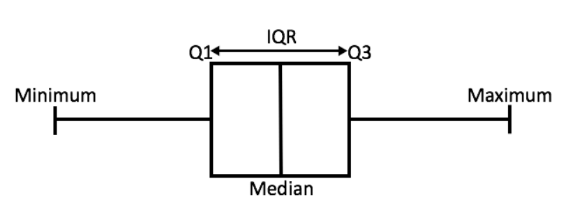
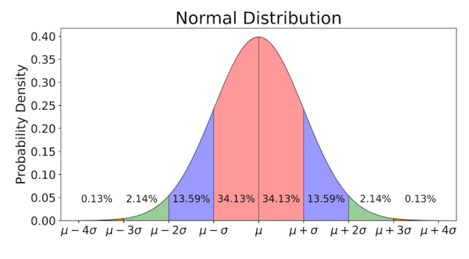

# :mag: Index

- [What is IQR ?](#idx1) 
- [What is IQR rule ?](#idx2) 
- [Why "1.5" ?](#idx3)
- [Reference](#idx4) 

---


### :radio_button: What is IQR? <a id="idx1"></a>

데이터의 분포를 확인하는 방법에는 평균과 표준편차를 이용하여 알아보는 방법도 있지만 , 4분위수를 통해 알아보는 방법도 있다. 데이터의 값의 평균이 아닌 __중앙값__ , 즉 순서대로 줄지어 있을때 정 가운데 순서에 위치하는 값을 기준으로 왼쪽,오른쪽으로 나누고 나뉜 두 집단을 다시 동일하게 중앙값을 찾아 분할하여 전체 데이터를 4분할 할 수 있는 기준 값들을 찾는다. 이때 왼쪽(작은쪽) 집단의 중앙값에 해당하는 값을 1분위수, __Q1__ 이라 부른다. 반대로 오른쪽(큰쪽) 집단의 중앙값에 해당하는 값은 3분위수 , __Q3__ 라 부르는데 통계학에서는 이 두 분위수의 차이를 __`IQR (Inter Quantile Range)`__ 라 부른다.


__※ 위에서 언급한 중앙값, 분위수를 통해 데이터를 시각화 하는 방법으로 Boxplot 이 있다.__



 

---


### :radio_button: What is IQR rule ? <a id="idx2"></a>

> 그래, 뭐 그런가보다.. 4분할해서 각 기준을 Q1,Q2,Q3,Q4 라 이름 붙이고 Q3-Q1을 IQR 이라 부르겠다.. 
>
> 까지는 알겠는데 그래서 IQR 이 뭐 어디 쓰이는 것이고 수치적으로 무슨 의미가 있을까?


데이터 분석 , 데이터 전처리에 있어 결측값 처리 , 단위 재조정 , 특성 추출 등등 다른 중요한 작업도 많지만 IQR이 쓰이는 중요한 작업은 바로 __' 이상치에 대한 처리'__ 이다. 평균의 속임수라는 말도 있듯이 다른 데이터들에 비해 이상할정도로 작거나 큰 극 소수의 데이터들이 전체 데이터를 해석하는데 있어 전혀 다른 결과를 내놓게 할 수도 있다. 이런 데이터들은 그 비율이 무시할 정도라면 보통 분석에서 제외시킨다.


 문제는 어느정도면 이상치라고 할 수 있는지 그 기준을 어떻게 정하냐 하는것인데, 그 중 기초가 되는 방법이 위의 IQR을 활용하는 방법이다. 위에서 Q1 , Q3 지점이 전체 데이터의 1분위(25%) , 3분위(75%) 에 위치하는 값을 지칭한다 했는데 IQR 을 통한 이상치 구분은 다음과 같이 진행된다.


- Lower Bound (하위 경계) : Q1 - 1.5*IQR
- Upper Bound (상위 경계) : Q3 + 1.5*IQR


이런식으로 두 경계를 지정하고 하위 경계보다 작거나 상위 경계보다 큰 값들을 이상치로 보겠다는 것이다.


__※ 하위 경계와 상위 경계 사이를 Decision range 라고 부른다.__ 


---

### :radio_button: Why "1.5" ? <a id="idx3"></a>

> 아 저런 식으로 하한선 , 상한선 같은걸 정하고 나머지를 이상치라고 한다고.. IQR 이 저기 쓰이는거고..
>
> 근데 1.5는 뭔 숫자지?


숫자 __'1.5'__ 는 가우시안 분포를 통해 어디서 왔는지 찾을 수 있다.





어떤 데이터가 위처럼 평균μ 와 표준편차 σ 의 가우시안 분포를 따른다 가정했을때 그 중 특정 데이터가 [μ-σ , μ+σ] 범위에 속할 확률은 68.26% 이다. 즉 평균에서 표준편차의 각 배수마다 68.26% , 95.44% , 99.72% 의 신뢰도를 갖는 구간으로 구분되는데 통계학에서는 μ-3σ 보다 작거나 μ+3σ 보다 큰 0.28% 의 작은 구간에 (그림에서 빨간 두 모퉁이) 속한 값을 __`이상치`__ 로 판단한다.


이때 Q1 , Q3 는 각각  μ-0.675σ ,  μ+0.675σ 에 위치하는데, 이를 바탕으로 [μ-3σ , μ+3σ] 의 신뢰 구간을 만들 수 있는 상수가 바로 `hereinafter scale` 라 부르는 숫자 __1.5__ 인것이다.


```
if scale = 1
lower bound = Q1 - 1 * IQR = -2.025σ
upper bound = Q3 + 1 * IQR = 2.025σ
=> [-2.025σ , 2.025σ] : too far from 3σ
```


```
if scale =2
lower bound = Q1 - 1 * IQR = -3.375σ
upper bound = Q3 + 1 * IQR = 3.375σ
=> [-3.375σ , 3.375σ] : over 3σ
```


```
if scale = 1.5
lower bound = Q1 - 1 * IQR = -2.7σ
upper bound = Q3 + 1 * IQR = 2.7σ
=> [-2.7σ , 2.7σ] : appropriate
```


__※ 사실 scale = 1.7 일때가 가장 정확하긴 한데 숫자가 뭔가(?) 예뻐서 1.5로 쓴다고 한다.__ 


---


### :radio_button: Reference <a id="idx4"></a>

- [https://towardsdatascience.com/why-1-5-in-iqr-method-of-outlier-detection-5d07fdc82097](https://towardsdatascience.com/why-1-5-in-iqr-method-of-outlier-detection-5d07fdc82097) 


