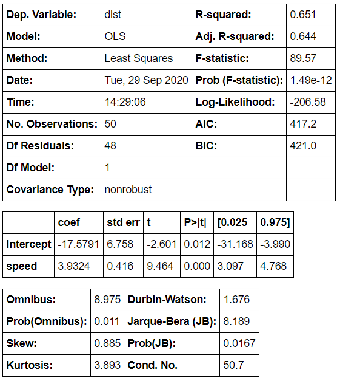

# :mag: Index

- [p-value 개념까지의 스텝](#idx1) 
- [귀무가설 (Null hypothesis: H0) VS 대립가설 (Alternative hypothesis: H1)](#idx2) 
- [1종 오류와 2종 오류](#idx3)
- [유의 확률과 p-value](#idx4) 
- [단일 선형 회귀 분석에서 p-value 적용 예시](#idx5)
- [p-value의 위험성](#idx6)
- [참고자료](#idx7)

---

### :radio_button: p-value 개념까지의 스텝 

1. __귀무가설 (Null hypothesis: H0) VS 대립가설 (Alternative hypothesis: H1)__ 
2. __1종 오류와 2종 오류__ 
3. __유의 확률과 p-value__ 

---

### :radio_button: 귀무가설 (Null hypothesis: H0) VS 대립가설 (Alternative hypothesis: H1) 

통계적으로 어떤 가설을 세우고 이를 검정하는 과정을 가설검정 과정이라 하는데 , 이런 가설검정에 있어 가장 먼저 하는것이 __귀무가설__ 과 __대립가설__ 을 세우는 것이다.

​	

- `영가설` 이라고도 부르는 귀무가설의 경우 __`모집단의 특성에 대해 옳다고 제안하는 주장`__ 이라고 정의되어 있는데 , 예시를 들자면 '미성년자의 평균 수면시간은 6시간 반이다.' 와 같이 `~와 같다.` , `~의 효과는 없다.` , `~와 같다.` 의 형식으로 이루어진 가정을 귀무가설이라 한다.

​	

- `대안 가설` 이라고도 부르는 대립가설의 경우 __`귀무가설이 거짓이라면 대안적으로 참이 되는 가설`__ 로 정의되어 있다. 위의 예시를 이어 대립가설을 세워보자면 '미성년자의 평균 수면시간은 6시간 반이 아니다' 와 같이 `~와 차이가 있다.` , `~의 효과는 있다.` , `~와 다르다.` 의 형식으로 이루어진다.

​	

---

### :radio_button: 1종 오류와 2종 오류 

위와 같은 두 가설을 세우고나서 귀무가설이 옳은지 , 옳다고 하기 힘든지 한쪽으로 판단하게 되면  이에 따라 2가지의 오류를 범할 가능성이 생긴다.

- 1종 오류

  - 귀무가설이 참인데 기각한 경우
  - (위 예시에 이어) 실제로 미성년자들의 평균 수면시간이 6시간 반인데 대립가설을 채택한 경우

  

- 2종 오류

  - 귀무가설이 거짓인데 기각하지 않은 경우
  - (위 예시에 이어) 실제로 미성년자들의 평균 수면시간은 6시간 반이 아닌데 귀무가설을 채택한 경우

※ 일반적인 경우 1종 오류가 2종 오류보다 더 심각한 오류라고 인식된다.

---

### :radio_button: 유의 수준과 p-value 

유의 수준이란 , 실험자가 1종 오류를 범할 수 있는 최대 혀용 수준을 말한다. (0~1 사이 값)

- 위의 예시를 이어 적용하면 , 유의 수준을 0.05 로 정하면 100번의 조사 중 1종 오류를 범하는 회수를 5까지 허용하고 5번을 넘어가면 유의 수준을 초과했다고 표현한다.

이 유의 수준에 의해 정의되는것이 바로 유의 확률, __p-value__ 인 것이다. 정확히는 귀무가설을 참이라 가정하고 조사하였을 때 1종 오류를 범할 확률로 정의되는데 이 p-value를 통해 해당 통계량 조사가 통계적으로 의미 있는지 여부를 판단하게 된다.

​	

위의 예시에 또다시 이어 적용하자면 , 실제 미성년자들의 수면시간을 조사하였을 때 p-value 가 0.05 라면 100번의 조사당 5번의 1종 오류를 범하였으며 나머지 95번에 대해서는 귀무가설이 참이라는 가설을 올바르게 기각했다는 뜻이며 , 이는 통계적으로 대립가설 '미성년자의 평균 수면시간은 6시간 반이 아니다' 을 채택하는것이 통계적으로 의미있음을 뜻한다.

---

### :radio_button: 단일 선형 회귀 분석에서 p-value 적용 예시 

speed 라는 독립변수와 dist 라는 종속변수로 이루어진 데이터셋으로부터 회귀식을 생성하고 해당 모델의 유의성 검적을 진행한 통계 요약이다.

​	

 

이때 두번째 표에서 Intercept , speed 의 coef 항목은 회귀식 __dist = b0+b1*speed__ 에서 각각 b0 , b1의 값을 의미한다. 

​	

또 , 옆의 __P>|t|__  항목은 각 회귀계수가 `해당 회귀계수는 0과 같다.` 의 귀무가설을 참이라 가정하였을 때 1종 오류를 범할 확률을 나타내며 , 경험적 수치 (0.05) 보다 작은것으로 보아 통계적으로 유의미한 수치라 생각할 수 있다는 것을 의미한다.

해당 회귀식 모델의 전체적인 유의성 평가는 첫번째 표의 __Prob (F-statistic)__ 수치를 보고 평가할 수 있는데 이에 대해서는 추후 더 자세히 다루도록 한다.

---

### :radio_button: p-value 의 위험성 ​ 

p-value , 유의 확률은 수치 하나로 모델의 유의성을 검증할 수 있는만큼 편리하지만 그만큼 많은 정보가 압축되어 있고 특정 상황에서는 실제 유의성 보다도 뻥튀기 될 수 있는 위험이 있는 지표이다.

​	

실제로 유의 확률은 효과의 크기 (effect-size) 혹은 표본의 크기 (sample-size) 가 커짐에 따라 데이터 성격에 상관없이 작아진다.  즉 , 귀무가설을 기각하는것이 맞으면서 대립가설이 거짓이 되는 오류가 발생할 수 있다. 

---

### :radio_button: 참고자료 

- [https://drhongdatanote.tistory.com/59?category=648822](https://drhongdatanote.tistory.com/59?category=648822) 
- [https://ko.wikipedia.org/wiki/%EC%9C%A0%EC%9D%98_%ED%99%95%EB%A5%A0](https://ko.wikipedia.org/wiki/%EC%9C%A0%EC%9D%98_%ED%99%95%EB%A5%A0) 
- 멀티캠퍼스 __정성훈__ 교육생의 생동감 넘쳤던 1시간 강의 :star: ​
